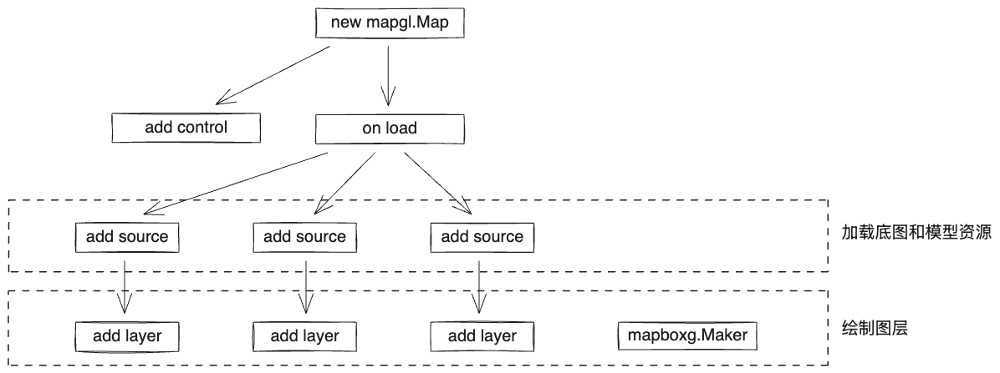

## Layer 图层分类

Mapbox GL 提供了多种图层类型用于地图渲染：

| 图层类型 | 用途说明 |
|---------|---------|
| `background` | 用于地图背景 |
| `fill` | 适合用于渲染区域 |
| `line` | 适合用于渲染线条 |
| `symbol` | 用于显示符号和文本 |
| `raster` | 适用于显示栅格影像 |
| `raster-particle` | 适用于显示栅格粒子效果 |
| `circle` | 适合用于显示点数据 |
| `fill-extrusion` | 用于 3D 建筑物渲染 |
| `hillshade` | 用于 3D 地形渲染 |
| `heatmap` | 用于显示点的密度分布 |
| `sky` | 增强 3D 场景的天空效果 |
| `model` | 增强 3D 场景的沉浸感 |

## Expression 表达式

### 1. 数据操作符 Data Expressions

用于获取要素数据相关的信息：

- `get` - 获取属性值
- `has` - 检查属性是否存在
- `id` - 获取要素 ID
- `geometry-type` - 获取几何类型
- `properties` - 获取属性对象
- `feature-state` - 获取要素状态

### 2. 相机操作符 Camera Expressions

- `zoom` - 获取当前缩放级别

### 3. 组合 Composition

## Trouble Shooting

### 图标/文字重叠问题

当遇到图标或文字重叠时，可以通过以下配置控制碰撞行为：

| 属性 | 说明 |
|------|------|
| `icon-allow-overlap` | 允许碰撞时，当前图标显示 |
| `text-allow-overlap` | 允许碰撞时，当前文字显示 |
| `icon-ignore-placement` | 碰撞不影响其他 icon 显示 |
| `text-ignore-placement` | 碰撞不影响其他 text 显示 |
