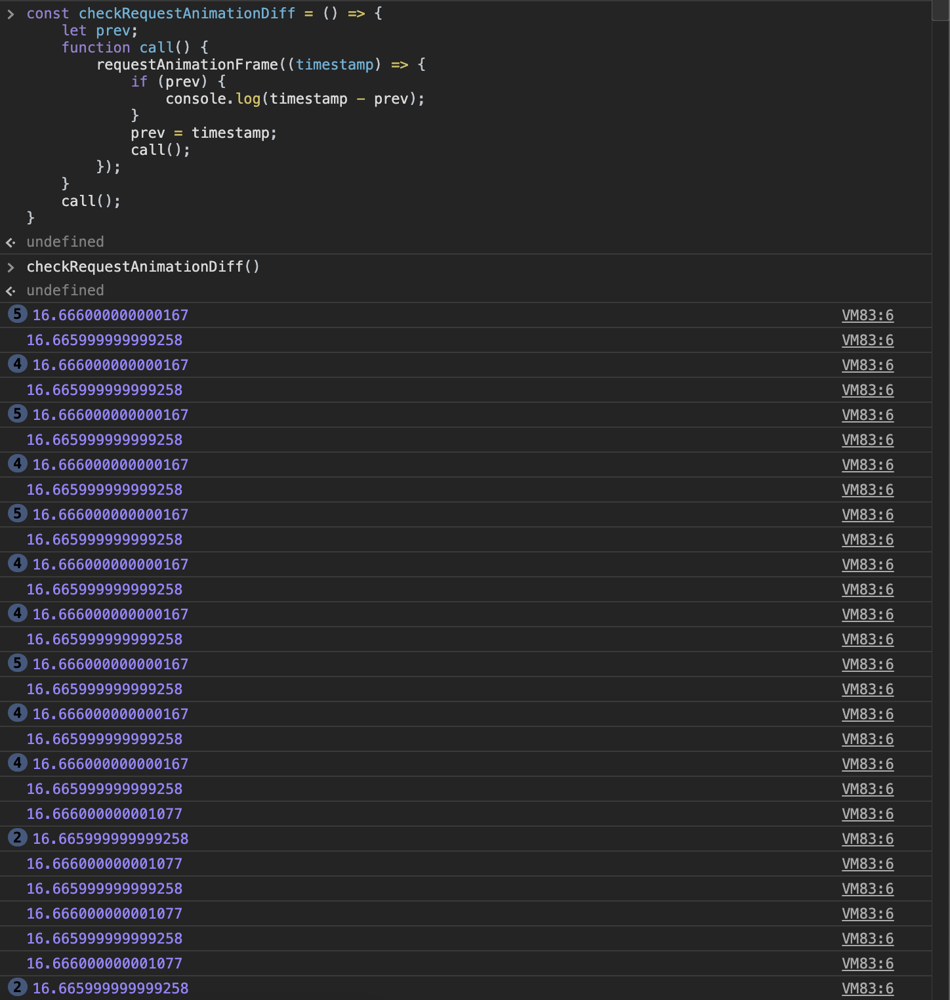

> 翻译计划： 2024.1 


> 此文翻译自： https://blog.xnim.me/event-loop-and-render-queue#heading-task-queue
> 已经获取作者授权

此文主旨在于关注**事件队列**， **执行顺序** 以及开发者如何**优化代码**。 完整思路如下：


## 事件队列

古老的操作系统不支持多线程， 那时候的事件循环就类似这样一个简单的循环: 

```js
while (true) {
    if (execQueue.isNotEmpty()) {
        execQueue.pop().exec();
    }
}
```

在老的操作系统上， 这段代码会疯狂跑满全部cpu。 （真的吗？ -- 年轻的译者注）
现代操作系统调度器非常复杂， 包括优先级，执行队列， 和其他的技术。

我们可以把事件循环理解为一个圆圈，系统就一圈一圈地检查， 有没有待执行的任务 （pending task）。


下面这些行为， 都会在事件循环里生成任务：

1. `script` 标签
2. 延迟任务： `setTimeout`, `setInterval`, `requestIdleCallback`
3. 浏览器的事件处理API: `click`， `mousedown`, `input`, `blur` 等等。
	1. 有一些事件是用户初始化的，比如点击事件， tab切换这种
	2. 有的事件是来自于代码， 比如 ajax 的响应啥的
4. `promise` 状态变化； （关于promise， 可以看这个[文章](https://dev.to/xnimorz/101-series-promises-1-how-promises-work-1k1i), emmm这篇文章是我准备留给2月份翻译的）
5. `DOMMutationObserver`, `IntersectionObserver` 这种 Observer 家族的
6. `RequestAnimationFrame`

> Almost everything we described above is planned through `WebAPI` (or browserAPI).
> 注: 这句不知道该咋翻译， 不过不重要...

举个例子， 有这么一行代码:
`setTimeout(function a() {}, 100)`
当我们执行 `setTimeout` 的时候，浏览器(WebAPI)会将任务延迟100ms. 到100ms了， 就把 `function a()`推进任务队列（TaskQueue）。  事件循环在下次循环中拿到并执行这个任务。

说到任务，  JS 代码和浏览器的执行最终都会反映在 DOM 上。

1. JS 代码: 
	- 读取 DOM 元素数据: size, attributes, positions 等等
	- 修改属性： `data-*`, `width`, `height`, `position` , css 属性啥的
	- 增删 HTML 节点

2. 然后浏览器渲染数据， 用户就能看到更新了。

现代浏览器用一个线程  执行 JS代码和渲染页面。 （除非我们开了 Web/Shared/Service worker)

这就意味着， 在事件循环里， 必须有渲染一部分留给渲染的时间。 咱可以把它叫做 渲染队列(render queue)


## 渲染队列是怎么执行的呢？

帧渲染(Frame rending) 不是一个单独的动作， 有好几个步骤。每个步骤都会再细分成子步骤。 下面展示了一般渲染一帧需要做的事情: 

让我们来深入一下每一步的细节


### Request Animation Frame （RAF）

浏览器已经准备好渲染了， 我们可以订阅这个时机， 并为这个动画步骤渲染和准备这一帧。 这个 callback 比较适合用在动画， 或者对DOM的一些操作上。

✍️ 关于 RAF 一些有趣的点：
1. RAF's callback  有一个参数 `DOMHighResTimeStamp` .  这个参数是一个从文档的生命周期开始至今的毫秒值。不需要用 `performance.now()`, 这里就有平替。
2. RAF 返回一个描述符（id）， 可以用来取消RAF( `cancelAnimationFrame`) , 跟 `setTimeout` 一个用法
3. 如果用户最小化了浏览器， 浏览器就不会再进行渲染动作了， 也意味着不会再收到RAF给的回调。
4. 改变DOM元素尺寸和读取元素属性的 js 代码， 可能会强制触发 `requestAnimationFrame` 
5. Safari 在 帧渲染之后调用 RAF。 它是唯一一个跟大家不一样的。 [https://github.com/whatwg/html/issues/2569#issuecomment-332150901](https://github.com/whatwg/html/issues/2569#issuecomment-332150901)

那么， 如何检查浏览器渲染帧率？看下下面的代码
```js
const checkRequestAnimationDiff = () => {
    let prev;
    function call() {
        requestAnimationFrame((timestamp) => {
            if (prev) {
                console.log(timestamp - prev); 
	            // 60FPS的时候这里应该是 16.6ms左右
            }
            prev = timestamp;
            call();
        });
    }
    call();
}
checkRequestAnimationDiff();

```

这里是执行结果



### Style （recalculation） 重新计算样式

✍️浏览器会在这一步重新计算样式。 这里也会计算媒体查询。

这里的重新计算， 包括直接改值的 `a.styles.left = '10px'` , 以及 css内容更改。比如 `element.classList.add('my-styles-class')`.  这里都会按照 CSSOM 和渲染树重新生成。
(译者注：CSSOM: CSS Object Model)

如果打开控制台， 打开这个 [hashnode.com](http://hashnode.com/) 网站， 可以看到 **Style** 阶段看到花费的时间。


### Layout 布局

✍️ 这一步计算布局， 元素位置， 尺寸以及相互之间的影响关系。 页面上的DOM越多这一步就越费劲。


布局 (Layout) 在浏览器里是一个相当费劲的操作。 下面是触发 布局(Layout) 的一些行为：


1. 读取跟元素尺寸和位置相关属性的时候 (`offsetWidth`, `offsetLeft`, `getBoundingClientRect`, etc.)
2. 写入跟元素尺寸和位置相关属性的时候。 不过也有一些例外( 比如 `transform` 和 `will-change`) 。 

> 下面这段没咋看懂， 好在也不影响主题
> `transform` operates in `composition` process. `will-change` would signal to the browser, that changing the property should be calculated in `composition` stage. Here you can check the actual list of the reasons for that: [https://source.chromium.org/chromium/chromium/src/+/master:third_party/blink/renderer/core/paint/compositing/compositing_reason_finder.cc;l=39](https://source.chromium.org/chromium/chromium/src/+/master:third_party/blink/renderer/core/paint/compositing/compositing_reason_finder.cc;l=39)

小结一下， Layout 负责: 
1. 计算布局变化
2. 元素插入到布局

✍️ Layout 在元素改变大小或读取元素属性的时候执行。 这个过程叫 强制布局 (`force layout`).  下方链接列出了会出发强制布局的属性： [https://gist.github.com/paulirish/5d52fb081b3570c81e3a](https://gist.github.com/paulirish/5d52fb081b3570c81e3a).

✍️ 当强制布局触发的时候，浏览器会暂停 JS 主线程。调用栈里有东西也不行，硬停。

比如下面的例子
```js
div1.style.height = "200px"; // Change element size
var height1 = div1.clientHeight; // Read property
```


浏览器需要先计算 `div1` 尺寸， 才能得到 `clientHeight` . 所以浏览器暂停了 JS 执行: `Style` 步骤检查改变的部分， `Layout` 重新计算尺寸。 `Layout` 不仅是计算 `div1`前面的元素， 后面的也要算。 现代浏览器会优化到不会每次都计算全部`dom`, 但是也没准儿，最糟的情况就会全算。 这个计算的过程叫 `Layout Shift` . 我们可以在下图中看到更改或移动的元素：


浏览器会尽量减少计算布局， 所以会把一些动作分组计算：
```js
div1.style.height = "200px";
var height1 = div1.clientHeight; // <-- layout 1
div2.style.margin = "300px";
var height2 = div2.clientHeight; // <-- layout 2
```

第一行改了 `div` 的高度
第二行，浏览器要读取属性， 但是咱们的高度改变还没动能， 所以浏览器要强制重新布局。
第三四行也是一样的。 
所以我们可以换一种更优的分组写法：
```js
div1.style.height = "200px";
div2.style.margin = "300px";
var height1 = div1.clientHeight; // <-- layout 1
var height2 = div2.clientHeight;
```

上面的写法可以让我们避免两次布局， 因为到了第四行的时候， 已经拿到了全部的数据了。

我们现在看到， 事件循环从单个循环变成了多个循环了， 因为我们会在任务和微任务的时候， 随时触发强制布局(force layout).


有的设备会这样优化布局:

1. 减少DOM 节点数
2. 把 属性读写动作 分组，以减少不必要的布局
3. 用 force composite 替代 force layout

### Paint 绘制


✍️ 我们在可视区域有了元素的位置和尺寸。 现在要给它涂颜色/背景， 开画


这步操作通常不会花费太多时间， 除了第一次渲染的时候可能比较长。 这步以后， 我们就可以**真正的绘制一帧**了。 最后一步叫做合成(Composition)


### Composition 合成

✍️ 合成(Composition) 是唯一一个默认GPU的阶段。 这一步浏览器只执行特定的css， 比如"transform".

**重要提示**： `transform: translate`不能“开启”GPU渲染。 所以如果之前有传言可以通过 `transform: translateZ(0)`开启GPU渲染，实际不行，是误解。

现代浏览器只会自行将一部分操作转为GPU操作。 我目前没找到最新的信息， 感兴趣的人可以自己看源码。[https://source.chromium.org/chromium/chromium/src/+/master:third_party/blink/renderer/core/paint/compositing/compositing_reason_finder.cc;l=39](https://source.chromium.org/chromium/chromium/src/+/master:third_party/blink/renderer/core/paint/compositing/compositing_reason_finder.cc;l=39)


✍️ `transform` 是复杂动画的最佳选择：
1. 我们不会每次都重新布局， 节省CPU时间
2. 这些动画不会有卡顿，（通过top, right, bottom, left可能会卡）

# 如何优化渲染？

✍️ 在每一帧渲染中， 最难的操作就是 布局(layout) 了。 当我们有复杂动画的时候， 每一次渲染需要移动受影响的DOM元素，这里就需要13-20ms（或更多）。  这就丢帧了，看起来性能不好。

想要优化性能的话， 可以跳过一些渲染阶段：


✍️ 我们可以跳过 布局(layout) ， 如果只是简单的改变颜色，背景啥的。


✍️ 也可以用 `transform` 移动同时不读取DOM属性的方式， 跳过布局(layout)和绘制(paint)两个阶段。 这样可能能会把他们缓存在内存里。

✍️**小结一下， 下面是具体建议：**

1. 尽量用CSS做动画， JS代码总会有开销。
2. 用 `transform` 移动
3. 用 `will-change` 属性。 给浏览器标记“准备好”要变的DOM元素。  [https://developer.mozilla.org/en-US/docs/Web/CSS/will-change](https://developer.mozilla.org/en-US/docs/Web/CSS/will-change)
4. 批量改变 DOM
5. 用 requestAnimationFrame  来有计划地在下一帧做变化
6. 合并对CSS属性的 **读/写** 操作， 并缓存他们。
7. 关注强制布局属性  [https://gist.github.com/paulirish/5d52fb081b3570c81e3a](https://gist.github.com/paulirish/5d52fb081b3570c81e3a)
8. 遇到异常情况， 最好开控制台看看，能找到具体是哪个阶段的问题
9. 要一步一步优化， 不要一次改多个地方。

# 最终事件循环长啥样？

我们可以在 [https://github.com/w3c/longtasks/blob/loaf-explainer/loaf-explainer.md#the-current-situation](https://github.com/w3c/longtasks/blob/loaf-explainer/loaf-explainer.md#the-current-situation) 这里看到现代浏览器事件循环的示意代码：
```js
while (true) {
    const taskStartTime = performance.now();
    // It's unspecified where UI events fit in. Should each have their own task?
    const task = eventQueue.pop();
    if (task)
        task.run();
    if (performance.now() - taskStartTime > 50)
        reportLongTask();

    if (!hasRenderingOpportunity())
        continue;

    invokeAnimationFrameCallbacks();
    while (needsStyleAndLayout()) {
        styleAndLayout();
        invokeResizeObservers();
    }
    markPaintTiming();
    render();
}

```

---

- 2024.2.8  13:51 终于翻完了初稿
- 