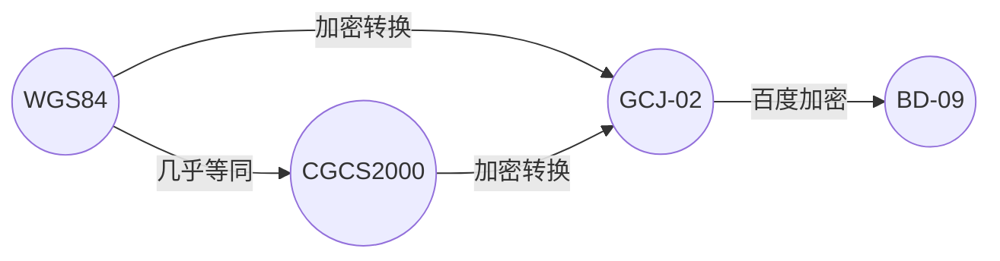

## 坐标系定义

|   坐标系    | 描述                         | 定义机构                        | 备注                                                  |
| :------: | -------------------------- | --------------------------- | --------------------------------------------------- |
|  GCJ-02  | 火星坐标系/国测局坐标系               | 中华人民共和国国家测绘局（现自然资源部测绘地理信息局） | 中国大陆所有互联网地图（如高德、腾讯、百度）都必须使用 GCJ-02 进行加密处理。            |
|   BD09   | 百度坐标系                      | 百度公司                        | 基于 GCJ-02 加密                                          |
|  WGS84   | World Geodetic System 1984 | 美国国防部                       | 国际通用的地球坐标系统，全球定位系统（GPS）采用该坐标系                       |
| CGCS2000 | 中国大地 2000 坐标系                | 中华人民共和国国家测绘局（现自然资源部测绘地理信息局） | 是中国的**法定大地坐标系**，直接对应于国际高精度坐标系 ITRF，是一种**真实物理地理坐标系** |



## 底图平台坐标系

| 平台                                                | 坐标系              | 投影坐标系                   |
| ------------------------------------------------- | ---------------- | ----------------------- |
| [百度地图开放平台](https://lbsyun.baidu.com/)             | BD09             | Web Mercator（EPSG:3857） |
| [高德开发平台](https://lbs.amap.com/)                   | GCJ02            | Web Mercator（EPSG:3857） |
| [腾讯位置服务](https://lbs.qq.com/)                     | GCJ02            | Web Mercator（EPSG:3857） |
| [国家地理信息公共服务平台（天地图）](https://www.tianditu.gov.cn/) | WGS84 / CGCS2000 | Web Mercator（EPSG:3857） |
| [mapbox](https://docs.mapbox.com/)                | WGS84            | Web Mercator（EPSG:3857） |

## 工作流程

### 1. 默认

```mermaid
graph LR
	Client(绘制模型) --WGS84--> Model(模型)
	Downloader(地图下载器) --WGS84--> Map(底图)
	Model --> Gis 功能
	Map --> Gis 功能
```

### 2. 项目有定制要求

```mermaid
graph LR
	Client(绘制模型) --WGS84--> Model-WGS84(模型-WGS84) --转换存储--> Model(模型 GCJ02)
	Downloader(地图下载器) --GCJ02--> Map(底图)
	Model --> Gis 功能
	Map --> Gis 功能
```
