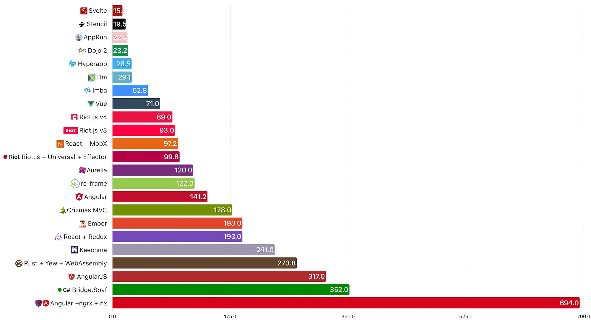

最近需要制作一个浏览器插件，实现通过插件， 修改目标页面的时间。
这里选择svelte作为开发框架，svelte作为无运行时的框架，可以减少代码体积(顺便玩玩没用过的框架)。

关于svelte和vue体积的对比， 前端圈子争论不休，挑出几个风靡一时的帖子看一下：
- [尤雨溪对比svelte和vue的构建体积](https://github.com/yyx990803/vue-svelte-size-analysis)
- [Jacek Schae 前端各框架对比](https://medium.com/dailyjs/a-realworld-comparison-of-front-end-frameworks-2020-4e50655fe4c1)

> 
> Jacek Scheae对多框架体积的对比图

## 浏览器插件简述

浏览器插件能做什么？ chrome 给出三个能力分类：
- 设计界面
- 控制浏览器
- 控制网络

详情可参考 [chrome插件开发文档](https://developer.chrome.com/docs/extensions/develop?hl=zh-cn) 了解具体使用。


## 项目结构

目前的结构是， `popup` 因为有页面，作为独立的svelte项目， 通过vite构建。
其他的部分， `content.js`, `background.js` 作为原生js编写，不需要构建，只需要从 `public` 移动到最终的`dist` 即可。

```
├── README.md
├── dist --------------------- 构建后的文件， 用于作为插件发布
│   ├── background
│   ├── content
│   ├── imgs
│   ├── manifest.json
│   ├── popup
│   ├── svelte
│   └── vite.svg
├── jsconfig.json ------------ vscode配置文件
├── manifest.json ------------ 插件配置文件
├── package-lock.json
├── package.json
├── popup --------------------- 插件弹窗, 其中为本次svelte项目
│   ├── App.svelte
│   ├── app.css
│   ├── assets
│   ├── index.html
│   ├── lib
│   └── main.js
├── public -------------------- 静态资源
│   ├── background
│   ├── content
│   ├── imgs
│   └── vite.svg
├── svelte.config.js ---------- svelte配置文件
├── vite-env.d.ts ------------- vite配置文件
└── vite.config.js
```


## 构建配置
目标是把所有的文件构建到 `dist` 目录下， 并保持`manifest.json`在根目录下， 各个部分在`menifest.json`的指定目录下。

vite.config.js
```js
export default defineConfig(({ mode }) => {
  const isProd = mode === 'production'
  return {
    root: isProd ? '' : 'popup',
    plugins: [
      // 把manifest.json复制到dist目录下
      viteStaticCopy({
        targets: [
          { src: 'manifest.json', dest: '' }
        ]
      }),
      // svelte官方插件： 构建popup部分
      svelte()
    ],
    build: {
      minify: false,
      rollupOptions: {
        // 让popup作为vite的构建入口
        input: {
          popup: resolve(__dirname, 'popup/index.html'),
        },
        // 输出配置
        output: {
          entryFileNames: '[name]/[name].js',
          chunkFileNames: '[name]/[name].js',
          assetFileNames: '[name]/[name].[ext]',
          // svelte作为独立chunk
          manualChunks: {
            svelte: ['svelte'],
          }
        }
      },
      modulePreload: {
        // 禁用 modulepreload polyfill, 这个特性 chrome 66就支持了
        polyfill: false
      }
    },
  }
})
```


## 构建后的结构

最终构建后的目录如下：
```
./dist
├── background
│   ├── background.js
│   ├── insert.js
│   └── mockdate.js
├── content
│   └── content.js
├── imgs
│   └── icon.png
├── manifest.json
├── popup
│   ├── index.html
│   ├── popup.css
│   └── popup.js
├── svelte
│   └── svelte.js
└── vite.svg
```

其中 `menifest.json` 配置各部分如下: 

```json
{
  "manifest_version": 3,
  "name": "SimulatedTime",
  "description": "Change the current time to simulation time!",
  "version": "1.0",
  "action": {
    "default_popup": "popup/index.html",
    "default_icon": "imgs/icon.png"
  },
  "permissions": ["scripting", "activeTab", "storage"],
  "host_permissions": ["<all_urls>"],
  "background": {
    "service_worker": "background/background.js"
  },
  "content_scripts": [
    {
      "matches": ["<all_urls>"],
      "js": ["content/content.js"],
      "run_at": "document_start"
    }
  ]
}
```


